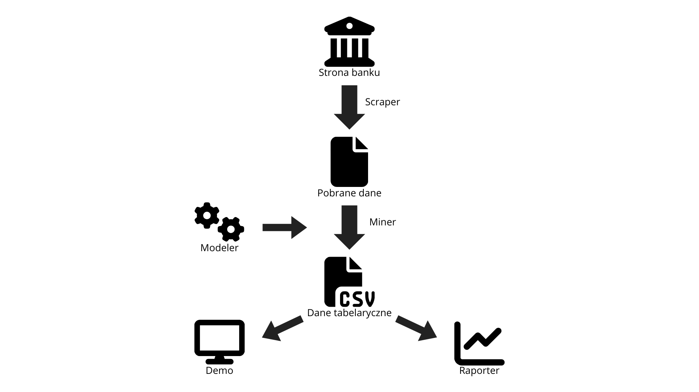

# Supervisionhack3 - DEPO_Predator

## Quickstart

1. Pobierz projekt i skonfiguruj środowisko wirtualne
2. Pobierz zależności
```
pip install --upgrade pip
pip install -r requirements.txt
```
TODO: instrukcja odpalenia, jak już wszytsko będzie skończone

## Moduły

* `files` - dodatkowe pliki statyczne (obrazki do readme, csvki z metadanymi banków etc.)
* `scraper` - lokalizowanie informacji na stronach banków
* `miner` - pozyskanie danych ze stron internetowych i dokumentów
* `modeler` - przygotowanie modeli
* `reporter` - generowanie raportów i wysyłanie powiadomień
* `demo` - aplikacja django z interfejsem gradficznym rozwiązania

## Architektura rozwiązania

Rozwiązanie jest podzielone na niezależne moduły. Poniższy schemat przedstawia poglądową architekturę i ideę rozwiązania.



## Dodatkowe źródła

1. [Google finance](https://www.google.com/finance/?authuser=1) - notowania giełdowe
2. [Bankier.pl](https://www.bankier.pl/gospodarka/wskazniki-makroekonomiczne/stopa-bezrobocia-pol#) - stopa bezrobocia
